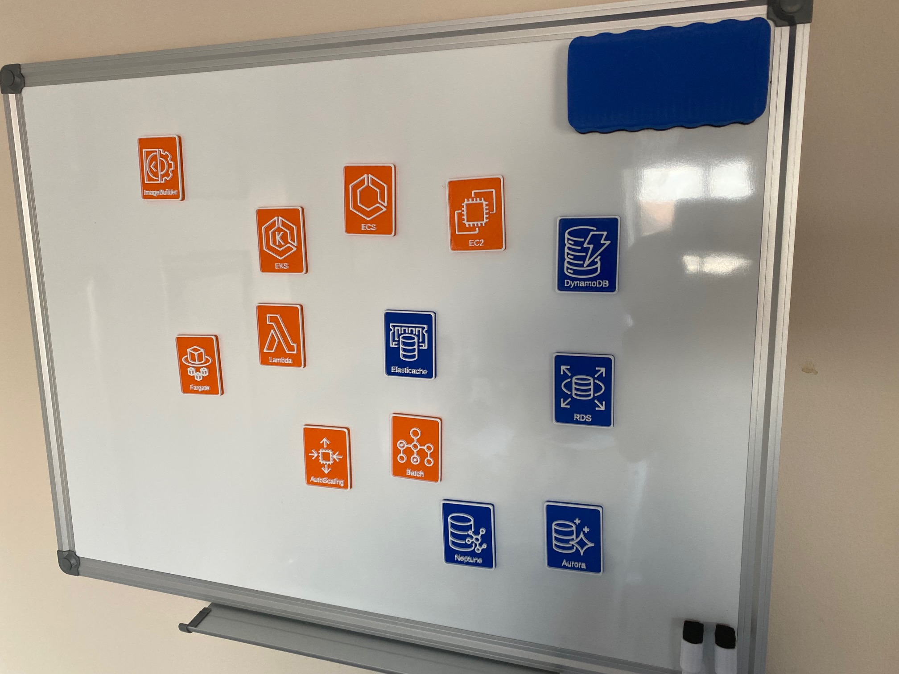
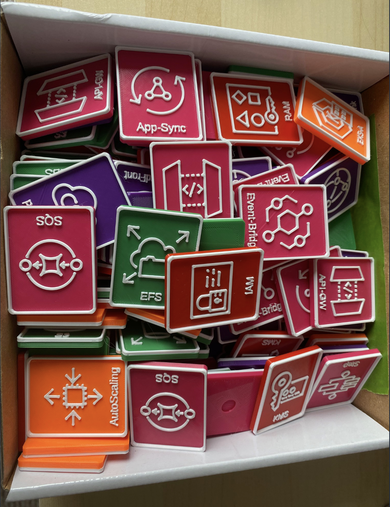
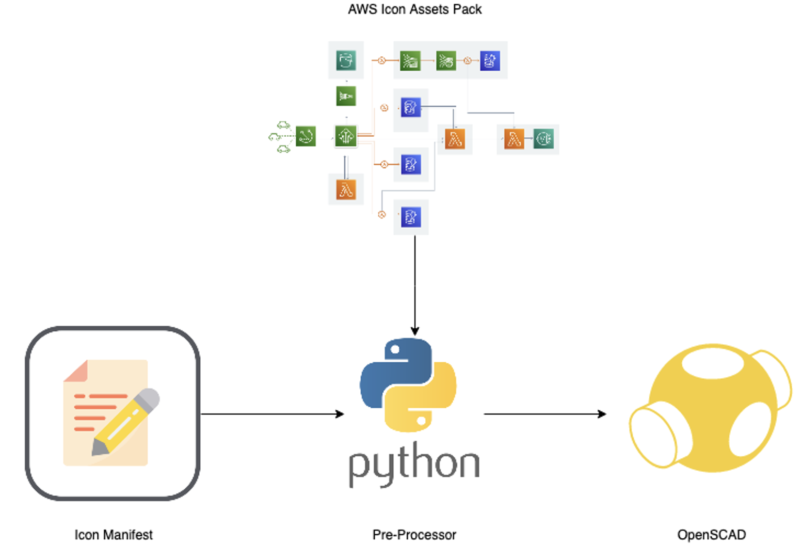

As a ProServe Consultant, I was looking for a fun gadget to use on whiteboards or interactive sessions and workshops with Customers.

Experts we may be, but artists we are not...even remembering the Icons for [200+ services](https://aws.amazon.com/products) is hard enough.

But sometimes nothing beats a dry wipe board to huddle around.

My answer was these...They are magnetic so they stick on magnetic surface whiteboards (I'm starting to curse the fashionable glass whiteboards now)

Naturally with 200+ services, I didn't want to draw these all by hand.

So I used the excellent [OpenSCAD](https://openscad.org/) which is a scriptable CAD to build a tile generator, I then feed this with Icon SVG's taken from Amazon's freely downloadable [icon sets](https://aws.amazon.com/architecture/icons/) via a batch processor. This automatically generates the tiles in whatever size or format I need.

With a simple addition to the manifest I can now create new tiles for new services, or regenerate the tiles in a different size/format.

## Resources

[Github Repo](https://github.com/WayneStallwood/AWS-Tile-Generator) for the generator here, could be easily adapted to generate tiles from any svg source. Some of the most popular tiles are pre-generated in the samples directory.

Jeff Barr did an excellent writeup [here](https://nextjeff.medium.com/3d-printable-aws-tile-generator-833a7f925ffa) of their experience making these tiles if you want to learn more about the process end to end.