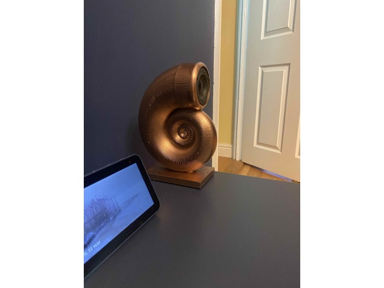
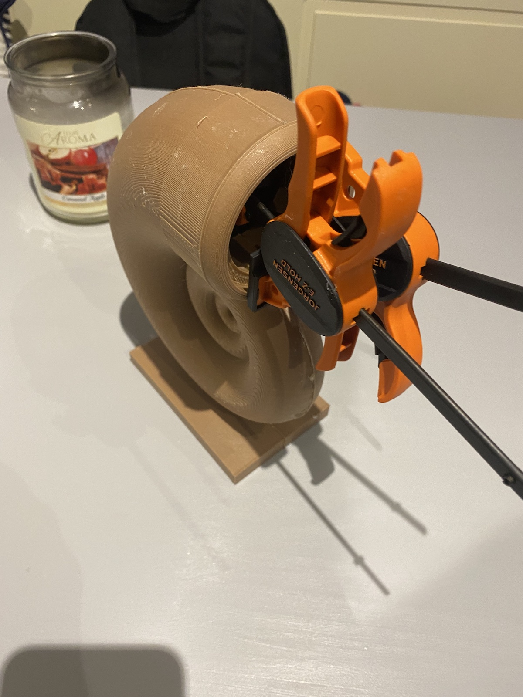
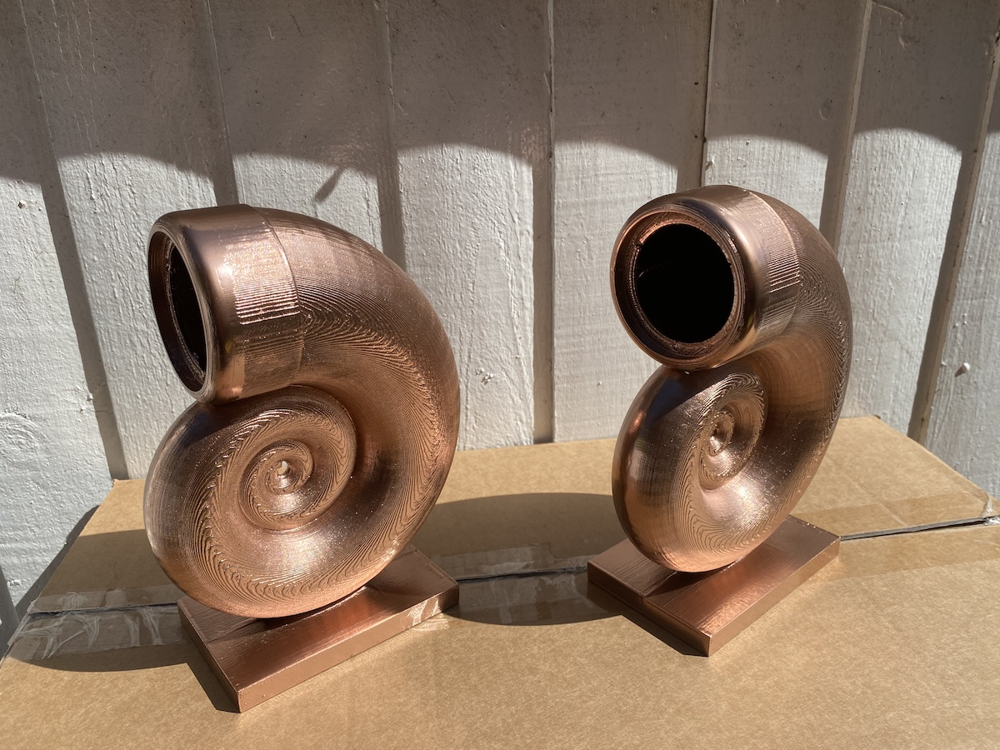

Couldn't quite find the right audio setup for the Living Room TV.

Didn't need a full Home Theatre setup, Didn't like soundbars I'd heard, The built in TV speakers...Lets not talk about built in TV speakers.

I've always been interested in higher end full range driver designs, time to do something.

I ended up with this, quarterwave Taper Tube loaded sealed satellites...with a Peerless 2" Long Throw Driver (the best one I could find) using a design I found on Thingiverse and tweaked a little to get the enclosure sizing right.

I coupled them with an old powered Subwoofer that was skipped due to faulty Power Supply capacitors and a Linn Knekt zone amplifier I've modified to not need all the Linn multiroom bits anymore.

They came out great looking and great sounding....the full range drivers with no crossover have a nice flat response down to about 150Hz when they start to taper off and the sub picks up.

This is a little higher than I'd like a Sub to operate at (you can start to tell the position of a sub from about 100Hz up) but these are tiny tiny 2" drivers and I've got the sub hidden between them in the cabinet they stand on so the positional problem isn't a problem.  Very impressed with how they sound for my first DIY Speaker.

## The Build

Printed them in two halves and at 0.4mm layer height to get the organic looking surface...I didn't want them to be smooth and perfect and to look more how a shell is formed.

Bamboo filament sounded a bit more "dead" acoustically, and is super easy to sand and finish. Clamped and glued with wood glue, finished the joins with wood filler.

No wadding required...you don't need to slow down the soundwaves so much when there is no flat backpanel to form a standing wave...and very little surface area on the baffle makes for quite an acoustically optimal enclosure.

I went "full steampunk" with the surface finish, I did try sanding and varnishing the bamboo and it looked nice but not quite the effect I was after.

So the final solution was Electroless plated copper....I do **not** recommend doing this at home, it requires some fairly nasty chemistry.

The beauty of this is they reflect light and tarnish just like real copper...they even smell like copper.

Compare this photo of when they were first plated to the photo at the top.

## Resources

[Thingiverse Project](https://www.thingiverse.com/thing:5381551)

[NE65W-04 Peerless(Vifa) Drivers](https://www.hificollective.co.uk/components/vifa-ne65w-04-full-range-driver.html)

**The above link is a really good price, might seem expensive for such a small driver, but these are about the best 2" driver you can buy, beware of clones if you try and buy elsewhere**

