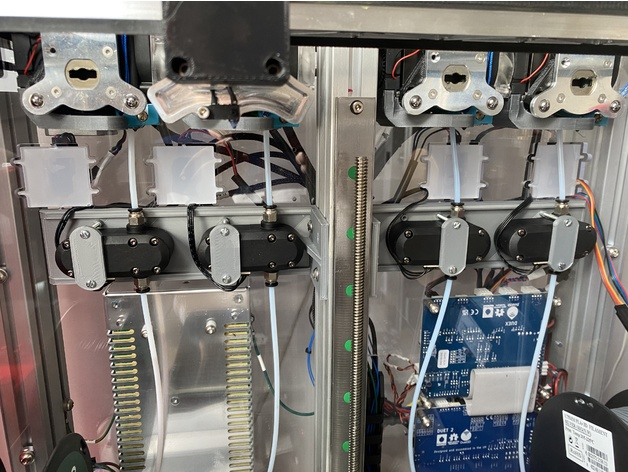
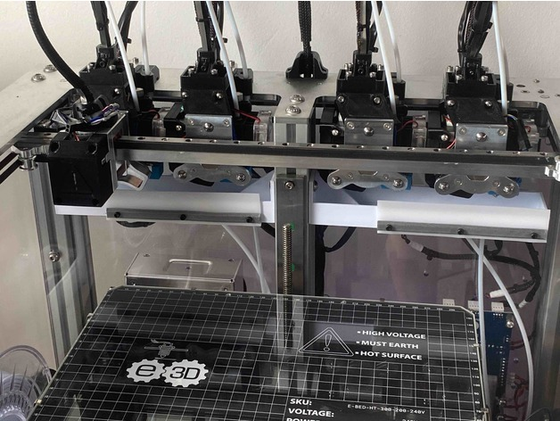

*Update: E3D have now discontinued the ToolChanger, leaving the repos and this information up for existing owners though*

My E3D [Toolchanger](https://e3d-online.com/products/toolchanger-hemera-bundle) Was a great machine, a few enhancements I or others have made linked below.

## Software

My Github [repo](https://github.com/WayneStallwood/3d-e3d-toolchanger-rrf3) for RRF3 Duet2 Toolchanger Configuration

My Github [repo](https://github.com/WayneStallwood/Slicer-Profiles) fork of Slicer Profiles

## My Hardware

BTT Smart Filament Sensor mounting bracket (saves drilling the back panel)

[Thingiverse Link](https://www.thingiverse.com/thing:5919842)

Simple Purge Bin and Wiper

[Thingiverse Link](https://www.thingiverse.com/thing:5357912)

## Other Projects

Kevin Mardirossain's Pebble Wiper [github repo](https://github.com/KevinMar1/Pebble_Wiper)

Rene Jurack's alternative Hemera PCF Duct [Cults3D](https://cults3d.com/en/3d-model/tool/well-engineered-hemera-fan-duct)

Rene Jurack's Detachable Spool Holders [Cults3D](https://cults3d.com/en/3d-model/tool/e3d-s-toolchanger-detachable-spool-holder)

ASMBL (Subtractive) Tool by Greg@E3D [Cults3D](https://cults3d.com/en/3d-model/tool/e3d-s-toolchanger-asmbl-subtractive-tool)