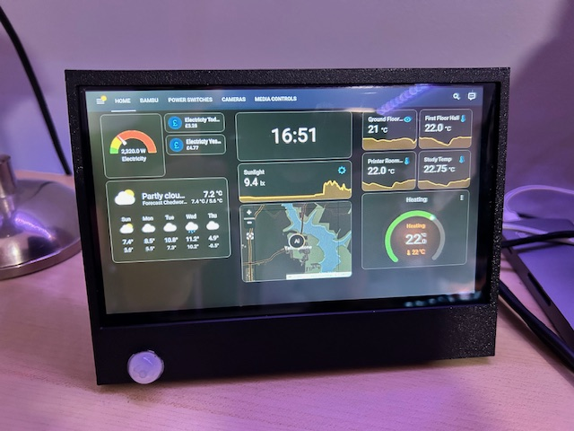
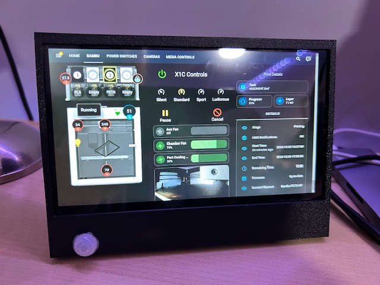

## Home Assistant Panel/Dashboard

I wanted a simple status display/control panel for Home assistant I could make cheaply enough to drop several around the house. It's super useful for just keeping an eye on things rather than having to helicopter Apps on my phone.

Previously I had tried this with various recycled Android tablets, but with limited success. So decided to give it a try with a Raspberry Pi. The BoM cost for this including a Pi4 (Recommended for the best responsiveness) is approximately £120

The software configuration would also work for Pi's being used for big screen dashboards.

  

## Hardware Requirements
 
Pi3 (B+ minimum recommended) or Pi4/5 (these would also support running HomeAssistant directly, but my HA runs in a container on my home server)

[Screen](https://www.amazon.co.uk/dp/B08GCM73MH)
*I used this one as it has piggyback connections for the Pi which neatens up the wiring*

[Power Supply](https://www.amazon.co.uk/dp/B0BN3W5T6J)
*You could use a high capacity MicroUSB/USB-C supply, but the connector ends up in an awkward place so this is neater if you use my case design*

[DC Connectors](https://www.amazon.co.uk/dp/B09TVG21DR)
*Panel Mount 5.5mmx2.5mm connector*

[PIR Sensor](https://www.amazon.co.uk/Hailege-Pyroelectric-Sensor-Infrared-Detector/dp/B08C5572W4)
*Only required for empty room power saving feature*

[Heatsinks](https://www.amazon.co.uk/VooGenzek-Heatsinks-Raspberry-Aluminum-Conductive/dp/B0CSKBRVXT)
*Not essential, but recommended for best performance*

If you want to use my case design then it is shared [here](https://www.thingiverse.com/thing:6900331), but this was a pretty rushed model just to get the displays functional...I'm waiting to find a neater alternative to the PIR sensor before I design something a little better, eventually I intend to wall mount these so will be redesigning the housing.


## Software Setup

**OS Setup**

There are various Kiosk mode specific distributions for the Pi, but none of them seemed particularly well maintained at the time of writing. So I decided to just reconfigure stock Raspbian...so just go ahead and grab the relevant release from [here](https://www.raspberrypi.com/software/) and configure as normal for your Pi model.


First clean up some things that may be on your Raspbian image that you really don't need.

```
apt purge wolfram-engine scratch scratch2 nuscratch sonic-pi idle3 -y
apt purge smartsim java-common minecraft-pi libreoffice* -y
apt clean
apt autoremove -y
apt update
```

Now install a few things we do need

```
apt install xdotool unclutter sed matchbox-keyboard
```

Launch raspi-config and enable AutoLogin (if not already enabled), you can find this under System Options

If you are on a Pi4 or later I'd also recommend switching from Wayland back to X (under advanced options) as at the time of writing I noticed some touch input problems with my screen when using Wayland....YMMV

Reboot and confirm autologin works and you get to a desktop

**Kiosk Mode**

For the Home Assistant panel we are going to use Chromium in Kiosk mode and then we are going to use a Systemd service to launch that and keep it alive. But before we do that it's a good idea to log the browser into your Home Assistant installation and make sure the "Keep logged in" option is set.

The easy way to do this is with a keyboard plugged into the Pi, if you don't have a spare USB keyboard then use matchbox-keyboard from the accessories menu (though this is a little fiddly on such a small screen)

I'd recommend creating a dedicated 'display' user in Home Assistant and making this a non-admin user. Log in as this user (you'll only need to do this once unless you reinstall Home Assistant), Then set the defaults as you'd like for the default screen and dark mode etc from the settings menu on the left.

Now create panel.sh in your Home directory the configuration of this file depends on if you want to use the PIR motion sensor or not.

In either script, change [YOURHOMEASSISTANT] to the address/DNS name of your Home Assistant installation.  If required change the scale factor for the zoom level you'd prefer on the panel pages.

Motion Sensor version, if you intend to use the PIR sensor detailed below then use this version:

```
#!/bin/bash

unclutter -idle 0.5 -root &

sed -i 's/"exited_cleanly":false/"exited_cleanly":true/' /home/$USER/.config/chromium/Default/Preferences
sed -i 's/"exit_type":"Crashed"/"exit_type":"Normal"/' /home/$USER/.config/chromium/Default/Preferences

/usr/bin/chromium-browser --noerrdialogs --disable-infobars --force-device-scale-factor=0.8 --kiosk http://[YOURHOMEASSISTANT]:8123 &

while true; do
   sleep 300
done
```

If you don't want to use the PIR motion detection then a few additional lines are required:

```
#!/bin/bash
xset s noblank
xset s off
xset -dpms

unclutter -idle 0.5 -root &

sed -i 's/"exited_cleanly":false/"exited_cleanly":true/' /home/$USER/.config/chromium/Default/Preferences
sed -i 's/"exit_type":"Crashed"/"exit_type":"Normal"/' /home/$USER/.config/chromium/Default/Preferences

/usr/bin/chromium-browser --noerrdialogs --disable-infobars --force-device-scale-factor=0.8 --kiosk http://[YOURHOMEASSISTANT]:8123 &

while true; do
   xdotool keydown ctrl+Next; xdotool keyup ctrl+Next;
   sleep 15
done
```

The non PIR version uses xdotool to simulate keypresses that flip the browser between tabs, so you can provide multiple URL's in a space separated format and it will flip between them (every 15 seconds)

Make this script executable

```
chmod 600 panel.sh
```

Now we will create a systemd service that launches this script.

As root/sudo create the following file (/lib/systemd/system/panel.service)

```
[Unit]
Description=Chromium Panel
Wants=graphical.target
After=graphical.target

[Service]
Environment=DISPLAY=:0.0
Environment=XAUTHORITY=/home/pi/.Xauthority
Type=simple
ExecStart=/bin/bash /home/pi/panel.sh
Restart=on-abort
User=pi
Group=pi

[Install]
WantedBy=graphical.target
```

**Important** if you selected a user other than Pi when configuring auto-login then you will need to modify USER,GROUP and the two file locations in the script above to match

**Testing**

Enable the new systemd service 

```
sudo systemctl enable panel.service
```

Now to test the first time I recommend you ssh in to your pi from another machine (so you have a way of stopping the service again if it's not working) once you have done that 

```
sudo systemctl start panel.service
```

If all has gone well the desktop should now be replaced with a browser that has opened Home Assistant and logged in automatically

At any point you can stop the service again to get back to the desktop, if something has gone wrong

```
sudo systemctl stop panel.service
```

## PIR Sensor

Adding this sensor with the first version of panel.sh above will achieve the following:

* Screen will sleep after 10 mins (default) of no movement in front of it, for an HDMI connected display such as the one I linked above the display will power down

* Any movement in front of the sensor will wake the display after a few seconds

* Any movement within the last 10 minutes will prevent the display going to sleep

* Live video on an active HA panel will prevent the display sleeping

There are various ways you can achieve this with some projects and scripts kicking around on github, but the simple one I settled on was to use the gpio-keys kernel module to mimic keyboard input from GPIO. This then wakes the screen on a Pi3/4 just as it would if you tapped a key on the keyboard...and keeps it from going to sleep when there is movement as it looks like keyboard activity. 

By mapping this to a non printing key it has no impact to normal operation.  It could also potentially wake the Pi5 from warm standby (as suspend to RAM is supported on the Pi5...but I haven't tested this yet)

*gpio-keys*

To enable gpio keys all we need to do is add this device tree overlay for the module to /boot/firmware/config.txt.  Simply add this line to the bottom of that file.

```
# Config for PIR sensor

dtoverlay=gpio-key,gpio=21,active_low=0,gpio_pull=down,label=wakeup,keycode=143
```

The PIR sensor I linked is active-high.  This config sets gpio21 (Pin 40 of the Raspberry Pi header) to low and when the PIR pulls it high it registers a key press on scancode 143 (Wakeup key).

Connect Vin of the sensor to pin 1 (3.3v) Out to Pin 40 and Gnd to Pin 39, reboot and you should be set.

## Power

As mentioned previously I didn't want to use the USB power input of the Pi (which via the USB standoff for the touchscreen also powers the display) because the screen I used ends up with this in an inconvienient place..plus finding USB supplies with at least 3A can be tricky. Therefore I use the 5v DC supply with a barrel plug as linked above...and then wire a DC socket to Pins 2 (+5v) and 6 (Gnd) Take care to wire the centre pin to pin 2 and the outer barrel to Pin 6 to match the polarity of the supply or you will damage the Pi

## Cooling

So far I haven't had the need to apply active cooling to the Pi...however to avoid temp warnings or throttling when displaying screens with rapid changes or video content I recommend attaching chip heatsinks to the Pi

## Booting

Personally I dislike the graphical splash boot default on the later builds of Raspbian and would rather a text mode boot where I can see what's going on...it also seems to boot faster. If you'd like this then run the following command (be patient on a Pi3 or on a slower SD card as it has to rebuild initramfs and this takes a while)

```
plymouth-set-default-theme -R text
```

## Wrapping up

So that's it...a pretty simple way to have a live panel/status display using a Raspberry Pi...I'm using this for Home Assistant with a set of customised panels in lovelace (Check out the [Mushroom card](https://github.com/piitaya/lovelace-mushroom) extensions for really touch friendly elements). But this could equally be used for any web based dashboard/control panel on any size of HDMI screen.

## Important Note

This isn't sufficiently hardened to be a public web kiosk, there are probably several ways of escaping the browser and launching other applications, particularly with a keyboard connected..the default user on a Pi is in sudoers etc etc...I would not recommend using this in a public space in its current form.


