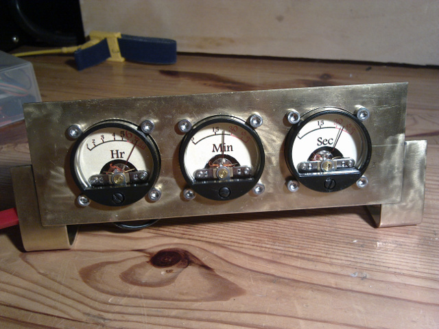
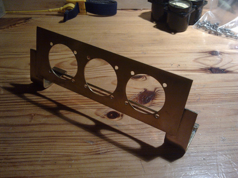
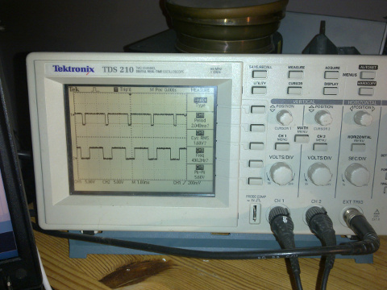
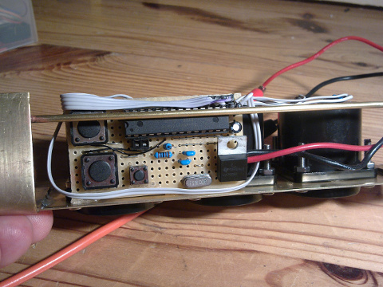
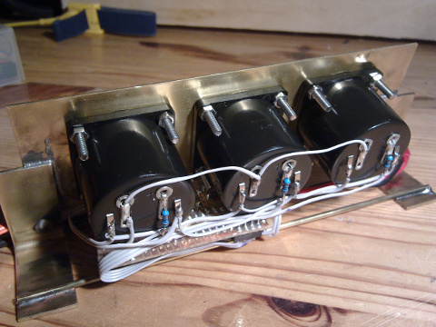

*Originally posted on digimatic.co.uk in 2011*

An oh so simple Arduino clock project based on VU Panel meters (the type you used to get on retro stereo systems) Uses the arduino playground time library so easy to sync to a variety of time sources such as an external clock chip or even internet time.

In the included basic example it just uses the on chip time reference and a couple of buttons to set it. It would be fairly trivial to change to show a linear timescale on non linear VU meters, but for the moment at least I decided I wanted them to have a VU like scale for that proper retro feel.

 
 

Sketch [here](../img/VU_clock.pde) , very simple as the library does most of the work for us. I keep thinking about fleshing it out with perhaps an Alarm function or Timezones or summat but we will see. I've commented it and written it to be easy to understand for beginners. If you are having problems building it make sure you have the time library installed correctly into your Arduio IDE. Get it here

Thanks to Alan at Katas Design for knocking up the prototype dial backs based on my very loose assumption of where the needles would be for a given time...and guess what they lined up almost perfectly on the first go.

I have been asked a few times for a schematic to build this so [here](../img/vumeter.pdf) it is