*Originally Posted on digimatic.co.uk in 2006*

A project to bring a 60's Hacker radio into the 21st Century

resurrect an old carcass which will be reborn into the digital age 

Before I started I had to find a cosmetically sound unit that was preferably beyond repair.

They are reasonably valuable when in full working condition. Anyway it would be a shame to destroy a good one

 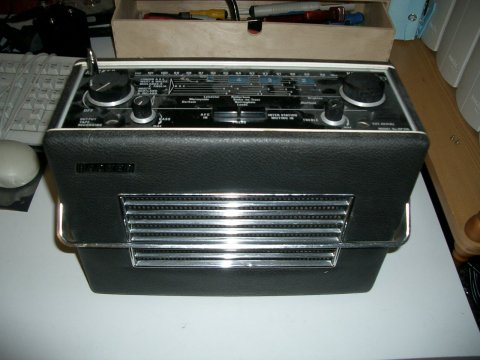

Next I needed a donor Netgear MP101 MP3 streamer

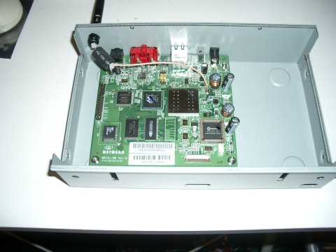

As you can see, due to the large speaker in these sets there are not many options of placement for the MP101' PCB

 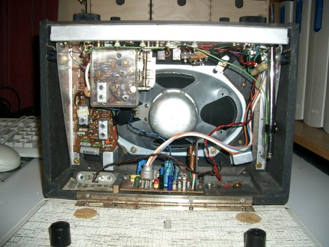

To make my life even more difficult the ribbon cable on the MP101's display is very short. It would be hard work to extend this
 
 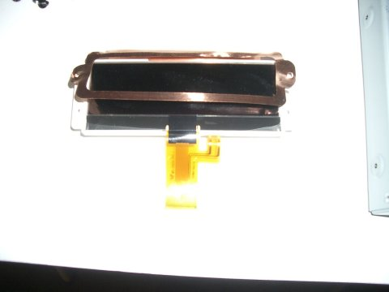

Removal of just a few screws will release the Hacker's chassis from the outer case. They don't make them like this anymore.

 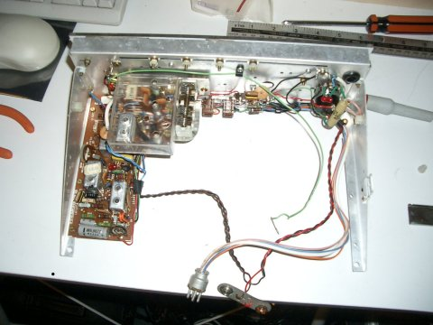

With the original electronics removed from the chassis we can start to get an idea of where everything will fit. For now I have left the wiring loom for the Amplifier in place, it will come in handy during initial testing.

 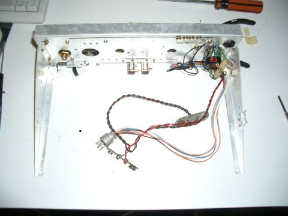

With the final positions for the Board and display decided. I can tag the output of the MP101 onto the original wiring and power up to check that everything works.

 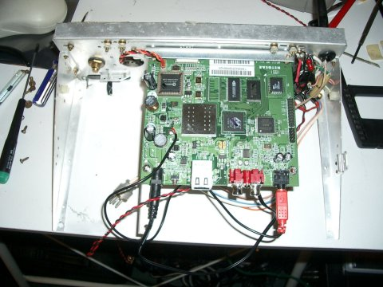

By using parts removed from the original chassis it is quite easy to provide a solid mounting for the PCB

 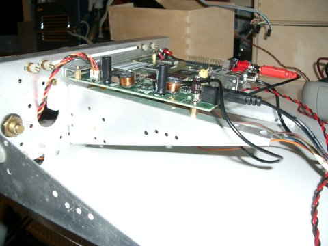

Here you can see how tight that ribbon cable really is. Also you can see the extended Antenna cable, this is quite hard to do properly and you need the proper RF cable.

 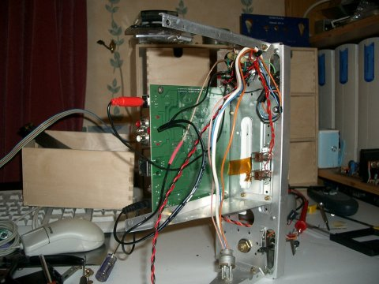

With the chassis back in the case we can check that everything fits around that speaker.

The original amplifier is connected for now, it could be left like this. However the transistors to repair these amps are getting quite scarce so I'd rather save this amp for an original radio. Also it was designed to run from 18 volts and clips easily on a 12 volt supply. I could have redesigned the battery supply for 18 volts but this would complicate the 12volt supply for the MP101. Also it would prevent the use of the original Netgear mains supply for charging.

 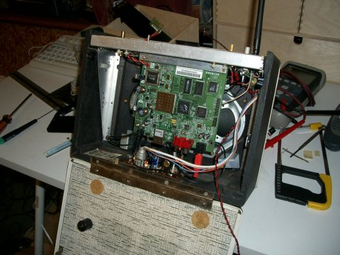

On the first run the good news is that it works, the bad news is that it clicks and hums a lot.

It seems I underestimated two things here. The Netgear PSU has a lot of mains ripple and the amp picks up a lot of noise from the Wireless Transmitter and the EL display backlighting.

For now I have substituted the Netgear PSU with a better Switch Mode Power Supply. The rest of the interference I choose to ignore until I have fitted the new Amplifier circuit.

 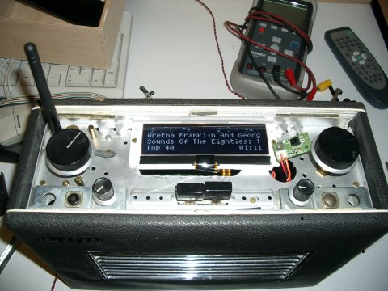

With the new Amp in place the original wiring loom can be removed. This Amp is mounted on the chassis (unlike the original one) This helps when trying to power the unit up out of it's case. I have also clipped the RF and Audio cables to the chassis to keep them as far apart as possible.

 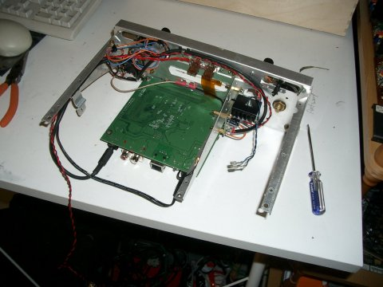

With the chassis refitted I can check how much space I have left for the battery pack.

 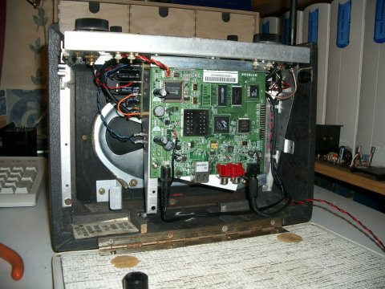

The MP101 board draws about 200MA and the Amplifier with the original 15Ohm speaker will consume anything up to about 800MA (depending on the volume setting of course) So it seems that some high capacity NIMH AA cells will give me at least a few hours play and in most cases much longer.

The interference is still a problem. I have been experimenting with different earthing and supplies around the Amplifier and managed to reduce this to a point where it is only audible between tracks or when the volume is at a very low setting. But clearly there is more work to be done here.

Other tasks include building or obtaining a suitable battery pack and sorting out a charging circuit. I also need to do something about a the tone controls. Finally I need to tidy up the case and do something with the dial glass.

 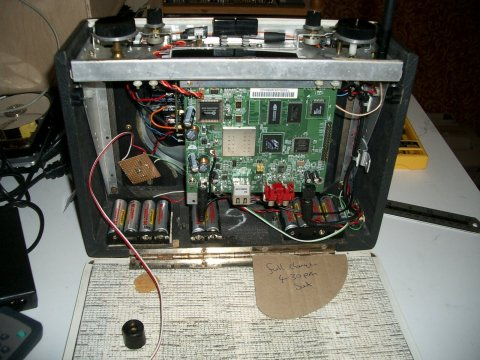

Batteries are now in. Some cheap NI-MH cells on Ebay motivated me to get cracking. The cells are mounted in standard AA holders screwed to the case. A single holder wouldn't have fitted in the middle of the case and I didn't want the weight distribution to go lop sided. So in the end I went for 2 4XAA holder and one 2XAA holder to bring us to 10 cells for a 12 Volt supply.

Also take note of the fuse holder on the right. If shorted a Ni-Mh cell will deliver quite a bit of current. Enough to melt the holders, wiring and destroy the cells, there is also a fire risk. So in the interests of safety a 20mm fuse holder has been fitted with a 1.25A fuse. This has been kept as close to the battery packs as possible to minimize the length of un-fused wiring.

 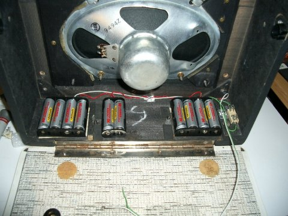

Here it is back together. The charging circuit is a simple constant current regulator I threw together from bits I had kicking about. I'll put some schematics up here at some point, but it is just a simple text book design. One peculiarity is that mine is built upside down with all the regulation done on the negative side. This is simply because I had run out of suitable PNP transistors.

The charge current is set at about 120mA. So it will take about 15 hours to charge. However at this rate the cells should be able to sit on charge permanently so if I forget to turn the charger off it shouldn't matter. Higher currents would give me faster charging times but a real danger of overcharging with this "dumb" circuit.

Eventually I want to replace this circuit with a proper smart charger, Probably PIC microcontroller based. This will give me a fast charge and look after the cells better. Also I could add features like indication when the unit is fully charged and a warning when the batteries are low.

To get the charge current the supply voltage has to be higher than the nominal voltage of the cells. The Netgear power pack is unregulated so even though it is rated at 12VDC it puts out 18 off load and 15 when supplying the charge current.

 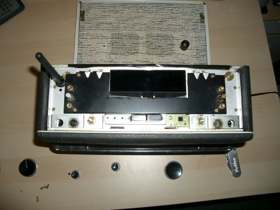

The original dial backing has been cut to reveal the LCD. This is also the support bezel for the dial glass. As you can see I have also mounted the IR receiver PCB.

Here is the modified dial glass being test fitted. The original silkscreen printed black background was originally overpainted with white to produce the lettering. This has a remarkable property of being both delicate yet difficult to remove (without damaging the acrylic it is printed on)

 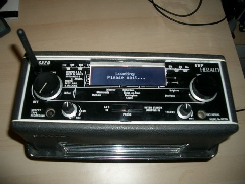

In the end I found the best was was careful masking around the window area I wanted to create followed by application of acetone. very little was needed to remove the dial print, but even this small amount slightly clouded the acrylic. This had to be polished before removing the masking.

You may wonder how the remote receiver works though the dial glass ?

It's clever, the white over-paint is pretty transparent and the receiver was carefully placed underneath the lettering to the left of the treble control...this works surprisingly well.

I wasn't completely happy with the look of the new window. I decided it revealed too much of the display edges and the sides of the sub bezel. This is mainly due to the distance between the dial glass and the display. I can't change this without either extending the LCD cable or completely reworking the top of the radio.

 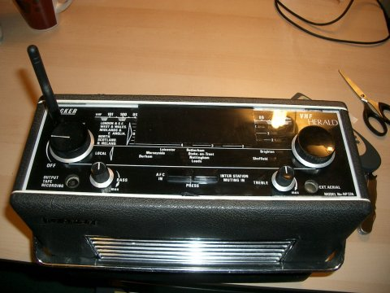

In the end I decided to smoke the display window. I used several coats of Tamiya PS-31. The effect is that the window is now completely black until the set is powered.
