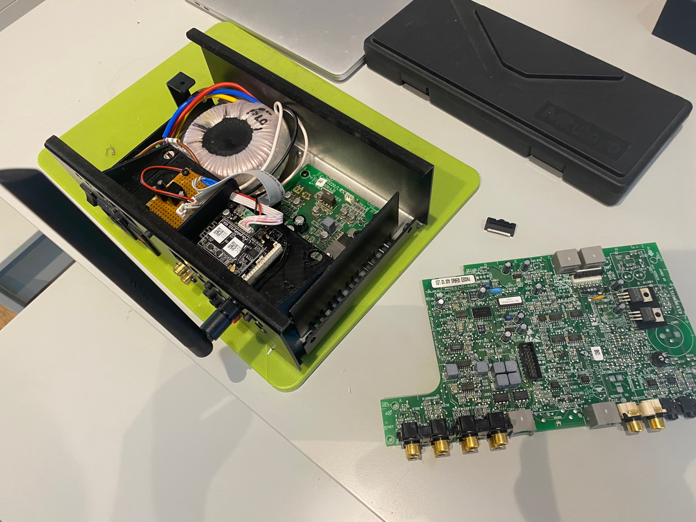

# Modifying Linn Knekt Zone Amplifiers

Found these little zone amps by Linn to be very cheap on eBay.  Originally they were something like £700 each, but at the time of writing they can be picked up for £20 or £30.

The Linn multiroom system is all obsolete (why they are so cheap) but by removing the original preamp board and replacing it with a streamer board from [Arylic](https://www.arylic.com/products/up2stream-mini-receiver-board) it's possible to convert them to use Airplay/Spotify Connect/BT Audio and Internet radio (via the pretty nice Arylic Mobile app)

Very simple conversion....I just 3D Printed a little shelf to go in place of the original PCB using the same screw mounts on the back panel.

Then cut into the ribbon cable that goes from the top preamp board to the lower power amp board and connect up the streamer board.

Pin-outs of the flat cable are as follows

| Pin | Purpose |
| --- | --- |
| 1 | VCC 5v 1A |
| 2 | Supply Ground |
| 3 | -50v Amp Rail |
| 4 | +50v Amp Rail |
| 11 | Audio Ground |
| 13 | Left Audio Input |
| 14 | Right Audio Input |

Note the regulator on the Amp board runs very hot with higher loads, to power the Arylic I'd recommend fitting a heatsink, I decided to build a dedicated DC-DC converter running from the +50v rail, but you could use the built in 5v supply if you added a heatsink to the regulator.

You can also just use these as a standalone power amp by unplugging the ribbon cable and then using the Audio Outputs on the back panel as Audio Inputs.

They are only rated at 25W RMS pwer channel, but sound bigger than that due to the oversized Power supply and transformer. Because they are class-d they run with only 5w or so current when idle...even powering the streamer board mine idles below 10w

