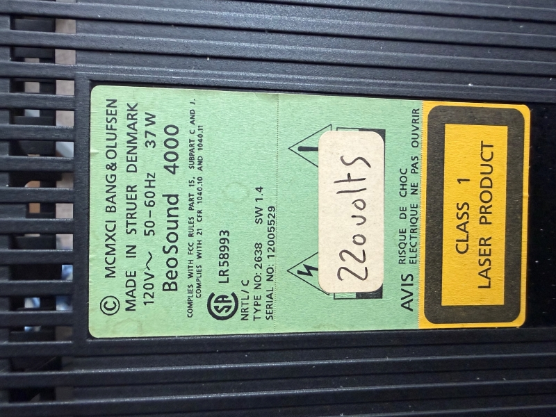
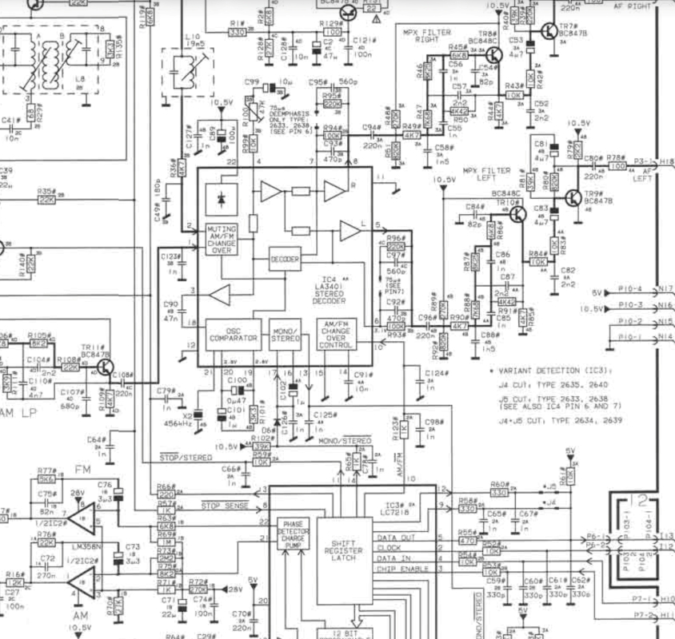
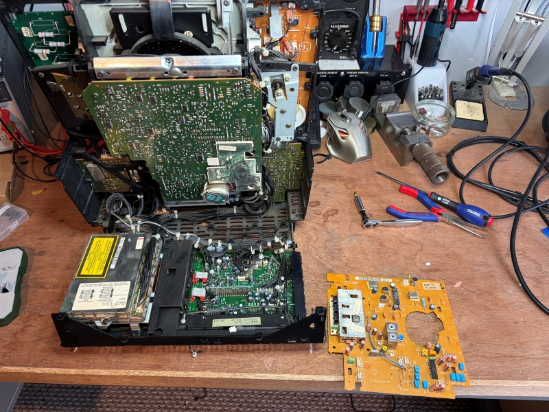
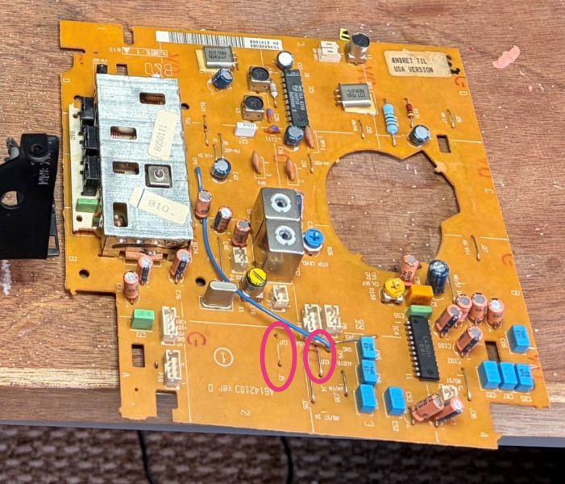
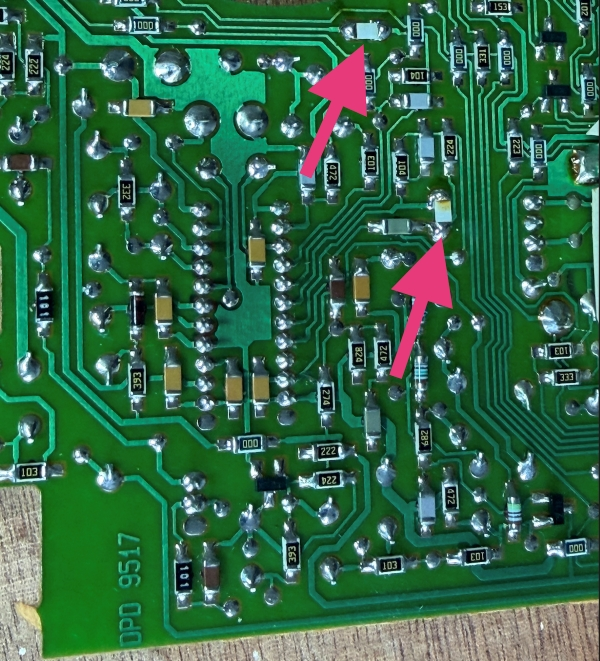
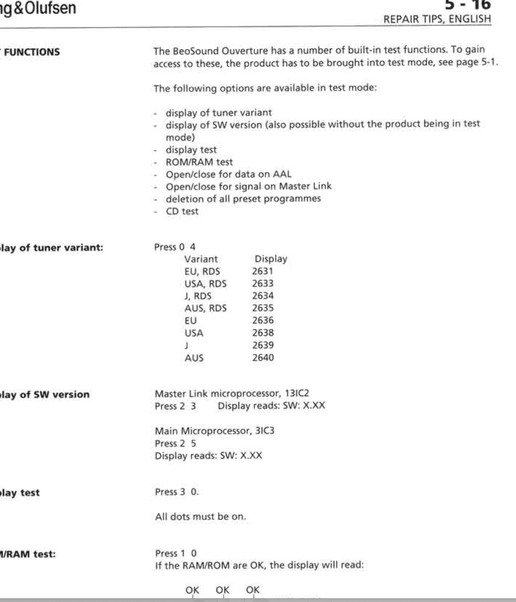
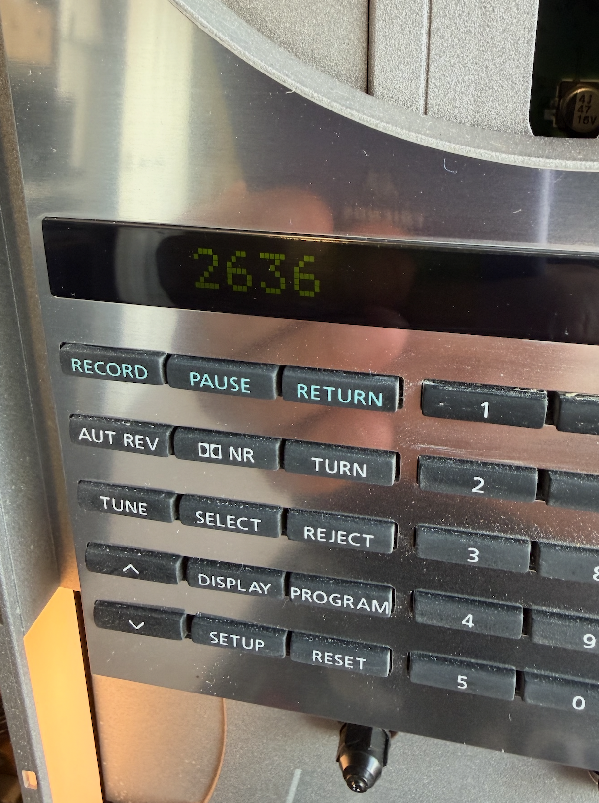

# Modifying Bang and Oulfsen BeoSound Overture/4000 FM Tuner Country version

Well I messed up a bit, I bought a cheap B&O Overture, to go with a spare set of BeoLab 6000 speakers, it needed the usual things (backup battery, belts, bulbs, dim display issue) but importantly the CD Transport was ok and the glass doors were intact.

What I didn't notice until it turned up is this unit is a US version that had been converted to run on 230v (not 220 as the sticker says)  It was a Type 2638, where I was expecting Type 2637 (UK no RDS) or Type 2632 (UK with RDS)

*Why is this important?* FM radio differs between US and UK (and some other countries) We have a slightly wider band, 0.1Mhz steps between stations (as apposed to US which is odd number decimal only) and the US use a different pre-emphasis 75us time constant vs 50us in the UK/EU.

The result will be a US tuner in the UK will sound overly bright and tinny, and a UK tuner in the US will sound muffled. The difference in frequency stepping (US 100.1,100,3 - UK 100.1 100.2 etc) will mean it's difficult to tune properly into all stations.

AM also differs (not that I use AM) 10khz tuning steps in the US 9khz in the UK

AI assisted searches told me I needed to find a UK/EU tuner board (part 2636) That's would be tough to find and an expense I didn't budget for when pricing up restoring this unit...But how different are those tuning boards really?

Turning to the service manual I noted the parts list was the same for both boards, it figures manufacturers generally don't want to actually make different variant boards. Then in the schematic there are some clues.

OK so the schematic shows the default (EU 2636) cutting J4 and J5 in different combinations changes the frequency range and stepping. Then there is a note about IC4 which changes the de-emphasis. So same board and components in a different configuration.

Lifting the board from the unit J4/5 are easy to find and indeed my US board has J5 cut as per the note on the drawing

These things are pretty packed inside, thanks to B&O's propensity to use 20 components when 5 would do, and circa 1994 technology in general. Bringing the back of the chassis into service position though and you can expose the tuner board. Take care to mark connector positions as there are a number of same size sockets and you'll cause a lot of damage if you get then wrong (especially if you plug the P5 plug into the P10 socket next to it)

J4/J5 are easy to spot here, Remaking J5 is simple enough

But the shorting links that enable the US de-emphasis settings are less obvious as they are SMD parts on the underside of the board.

Fortunately they stand out a bit as they are hand soldered additions made after the board was manufactured. In my case they are 0 ohm resistors added upside down. Tracing the circuit to confirm and simply removing the arrowed parts will set the unit to 50us Time Constant de-emphasis (or adding shorting links there to convert UK to US would do the opposite)

So those removed, J5 remade and board back in the unit, if I now enter the service menu I can see the correct EU tuner is now identified, frequency stepping is at 0.1mhz, UK tuning range enabled and a listening test confirmed the de-emphasis mod works.

Now showing correctly on my (dim) display

Perfect, and free rather than money spent trying to source the correct board.

Now just Backup Battery, Belts, Bulbs and Pinch Rollers to fit (all fiddly to fit on these) and sort that dim display. Then a good cleanup and after 30 years this great little system will be back in perfect working order.

My unit had been set to 230v (This is set by shorting links or 0 ohm surface mount resistors on the Transformer PCB under a small plastic cover) Where as officially it should be set to 240v for UK.

So I took the opportunity to change that and put less stress on the Transformer and PSU.

*The modified UK voltage is 230v +10% -6% and usually sits somewhere between 235 and 242v where I live, so setting transformers to 240v is more correct than 230 despite some references online saying UK voltage is 230v nominal*