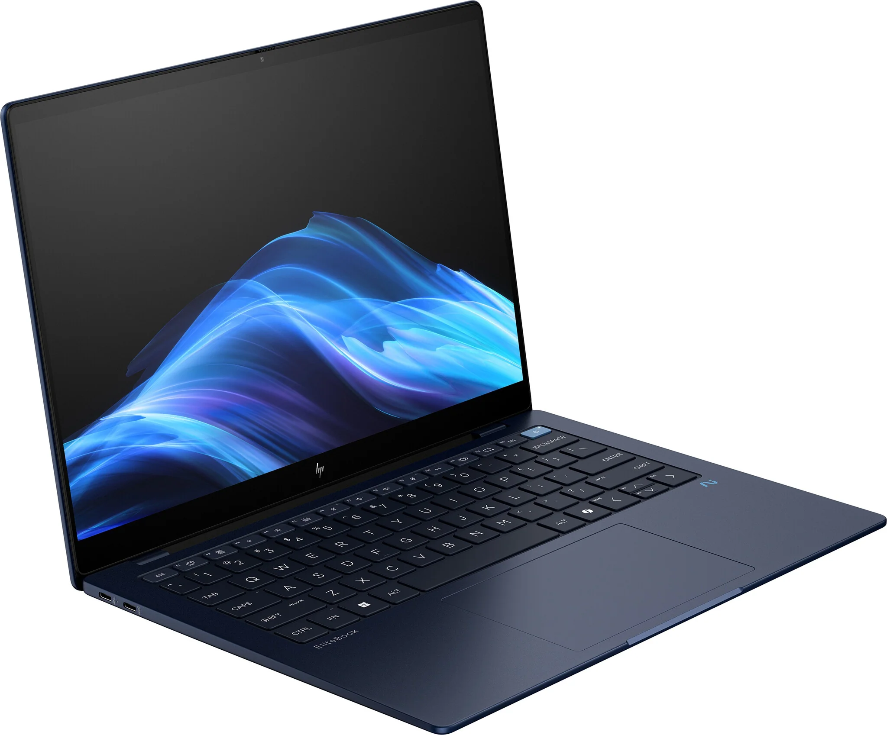

# Life on Arm with Windows

What is life like on Microsoft's first serious attempt at a major architecture shift for Windows (on the desktop at least)?

Follow my notes below as I make my attempt to use Windows 11 (Arm) as my daily machine

## Hardware

I'm not going to dwell too much on the hardware, this isn't a laptop review...Though there is little diversity in Arm Architecture for laptops at the moment, most machines offer a similar spec built around Qualcomm's Snapdragon X series SoC. Most of the machine is in the SoC so aesthetics/battery/keyboard aside there isn't much difference.

I opted for the HP Elitebook Ultra G1Q8, this is the lower spec with the Snapdragon X Plus SoC. A more expensive version is available with the Snapdragon X Elite which clocks a little higher and has 12 rather than 8 cores. But at the time of writing it was 40% more expensive. A cheaper alternative is also available in the Omnibook range, which has almost identical hardware but different support options and software load.

The only upgradeable component is the SSD you are currently stuck at 16GB of RAM (I would have liked 32GB)

It's a well packaged machine...I could go on but as I say this isn't a laptop review.

## Windows on Arm

Microsoft have dabbled with alternate architectures in the past. Alpha, Sparc, PPC to name a few for Windows NT...all of these ultimately failed due to limited software support. I was hesitant to even try because I wasn't even sure the Windows ecosystem could achieve this. But as an advocate of the Arm Architecture I had to try this time round.

For the most part my initial impression is most of the time for most users, you won't notice. Microsoft employ a binary translation layer called Prism that transparently converts any X86 binaries with what appears to be a limited performance impact. So far aside from checking in Task Manager...it's hard to tell what is being converted and what is running native Arm instructions.

The rest of the Windows 11 experience is just the same. The one area where Prism won't help is with hardware (kernel) drivers. Those need to be compiled for Arm, so beware if you are using any exotic hardware.

It's not perfect, I'm told the limited GPU on the Snapdragon SoC and the binary translation can cause issues with games, and occasional application compatibility issues may also arise. I'll keep a note of problems I do encounter lower down on this page.

## What's good

It's hard work to get the fan running at all, let alone audible. In normal use for example, as I type this into VSCode, with a browser running Plex playing some tunes and several other apps open in the background, the case isn't above skin temperature. 

The efficiency seems to help battery consumption too, HP specify up to 15 hours from this tiny light Ultrabook. In real life (with power saver mode off, moderate performance mode, and reasonable screen brightness) I'd say so far that 10 hours is completely achievable for moderate usage.

Native applications are quick...noticeably quicker than my previous 6 core Xeon based HP Zbook Studio. Translated applications seem to perform about the same as they did before on my old machine.

When comparing CPU counts, it's also important to note Arm architecture has no HyperThreading, so 8 CPU's shown in the OS is 8 physical cores, not 4 Cores with 2 Threads each.

Performance and efficiency I expect will only improve if or when more application providers support native Arm architecture.

## What's not so good

The fixed 16GB memory size is a little annoying. I do a bit of container development, occasionally I also want to run Virtual Machines. I fear I'll run out of memory on this machine long before I run out of CPU performance. System-on-Chip architecture has a lot of benefits but with the unified memory this ultimately limits choice and completely eliminates upgrade opportunities. Apple Silicon Mac's have the same issue, but at least 32GB models are available (at a considerable price hike)

The GPU is quite underwhelming, I've come from a machine with a discreet Nvidia Quadro GPU though, which if I didn't mind my battery life being reduced to 2 hours performed better than this. It's sufficient though for throwing around a few 3D designs in Fusion260 (even though that application is binary translated) This isn't a system I'd consider for gaming though even if games were ported to run native (most aren't)

As I mentioned there is the constant risk of application compatibility issues with this architecture, you are in a small group (currently) of users so operating on a less tested path. Anything that depends on a 3rd party kernel driver such as VPN software or Anti-Malware solutions you really want to be checking with the vendor

## Application Compatibility

I'll keep a list here of problems I encounter, there are also community [lists](https://windowsonarm.org/) that you can check.

### Resolved

* Bambu Studio (Crashes as soon as the proprietary Bambu Network Plugin is enabled on the current version) Previous version works, as does Orca Slicer (Stable build) so not a big issue for me at the moment (Fixed as of V2.0.2)

* [PIA VPN](https://www.privateinternetaccess.com) (Loads Network Drivers so had to be an Arm build, had to use a beta build of their Arm version, but that seems to work fine)

* Draw.IO (scoop was picking the x86 binary, reported to scoop package owner and fixed within 24 hours)

### Unresolved

* Win-Kex in WSL (This provides a desktop GUI experience for my Linux Subsystem. I can't get this to work due to binary compatibility between my Arm based WSL kali-linux distro and the Windows binaries it needs to load, possibly there is a workaround I just haven't figured out yet)

*Note: I generally recommend using a package manager for Windows, particularly if like me you came from Linux and are used to such conveniences. But this becomes even more useful on Windows-Arm as Win-get and [Scoop](https://scoop.sh/) seem to automatically prefer Arm built packages when available. This really helps in making sure you are downloading the right architecture version. I haven't tested [Chocco](https://chocolatey.org/) yet as I just prefer the way Scoop does things.*